# Cabeleleila Leila — Agendamento online

Sistema de agendamento online do salão da Leila (caso técnico DSIN): API + painel administrativo + área do cliente.

## O que existe hoje

- **Cadastro e login** com sessão em cookies `HttpOnly`, refresh token com rotação e proteção CSRF
- **Papéis** de cliente e administradora, com rotas protegidas por padrão
- **Perfil** do usuário (nome e telefone)
- **Catálogo:** serviços, profissionais, serviços que cada profissional executa e expediente semanal, com listagens paginadas
- **Agendamento:** assistente de 3 passos (serviços + profissional, data/horário, revisão), com disponibilidade calculada em tempo real (expediente, antecedência mínima, sobreposição), aviso de sugestão da mesma semana, reposicionar/adicionar/cancelar item, regra das 48 h para o cliente
- **Fila da administradora:** agendamentos pendentes, ações por item (confirmar, iniciar, concluir, marcar falta, cancelar), reposicionar/adicionar, linha do tempo (quem fez o quê)
- **Painel gerencial semanal:** faturamento, atendimentos, taxa de cancelamento/falta, ranking de serviços, ocupação por profissional, gráfico por dia — com comparação com a semana anterior e navegação por semana
- **Frontend completo:** área do cliente (mobile-first) e área administrativa (desktop), React + TanStack Router/Query, cliente HTTP gerado a partir do OpenAPI
- **Documentação interativa** (Swagger) e **dados de demonstração** (seed, incluindo agendamentos da semana atual em todos os status)
- **Testes** unitários e de integração com Postgres real, e testes de frontend com Vitest + Testing Library

## O que ficou para depois

Por causa do prazo, alguns itens do escopo original não entraram nesta entrega:

- **Notificações por e-mail:** a tabela `outbox_events` já é gravada na mesma transação de cada ação notificável (criar, confirmar, reposicionar, adicionar, cancelar), mas **não há worker** consumindo essa fila nem envio de e-mail de verdade pelo Mailpit ainda — o Mailpit sobe no `docker-compose.yml` para quando esse passo for feito. Faltam o relay (mover linhas da outbox para uma fila do BullMQ) e o processor (enviar o e-mail com retry).
- **Lembrete 24 h antes:** depende do worker acima (job repetível lendo `reminder_sent_at`); não implementado.
- **Testes end-to-end:** cobertura hoje é unitária + integração (banco real) no backend e unitária/componente no frontend. Um passo de e2e de verdade (fluxo completo no navegador) com **Playwright** ficou para trabalho futuro.
- **Edição de expediente sem checar agendamentos existentes:** `PUT /professionals/:id/working-hours` substitui o expediente inteiro sem olhar para agendamentos já `CONFIRMED` fora da nova faixa — confirmar um agendamento não trava o expediente, e a administradora pode remover um dia de trabalho mesmo com atendimento confirmado naquele dia. O que já funciona corretamente é o outro lado: sem expediente configurado para aquele dia (folga), o cliente **não consegue** marcar horário com aquela profissional nesse dia — o cálculo de disponibilidade (`AvailabilityCalculator`) exige uma faixa de expediente com o mesmo dia da semana para considerar o horário válido.
- **Cache do painel é só TTL**, sem invalidação ativa — ver a decisão em "Cache do painel" abaixo.

## Design

O documento de design completo (escopo, regras de negócio, modelo de dados, concorrência, API, frontend, decisões de arquitetura) está em [`docs/design.pdf`](docs/design.pdf).

> PDF do documento de design: **a adicionar em `docs/design.pdf`** (link ficará aqui após a exportação).

## Prints e vídeo

Prints organizados por perfil em `docs/screenshots/`.

### Desktop

| Swagger (`/api/docs`) |
| :---: |
| 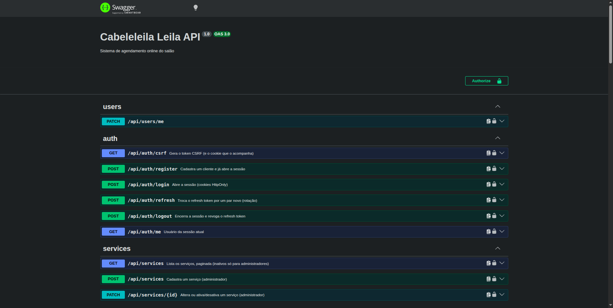 |

| Login | Criação de usuário |
| :---: | :---: |
| 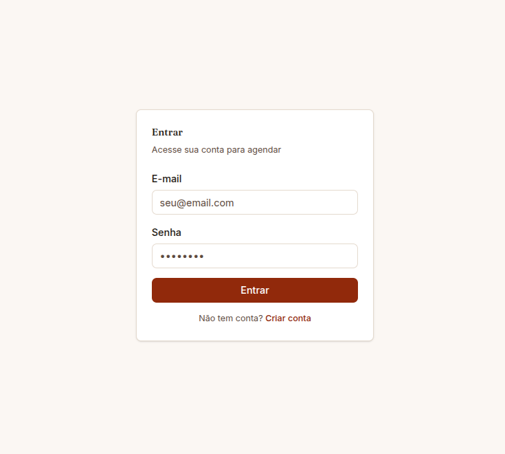 | 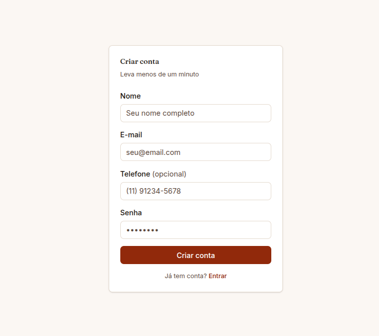 |

#### Admin

| Painéis | Fila de agendamentos |
| :---: | :---: |
| 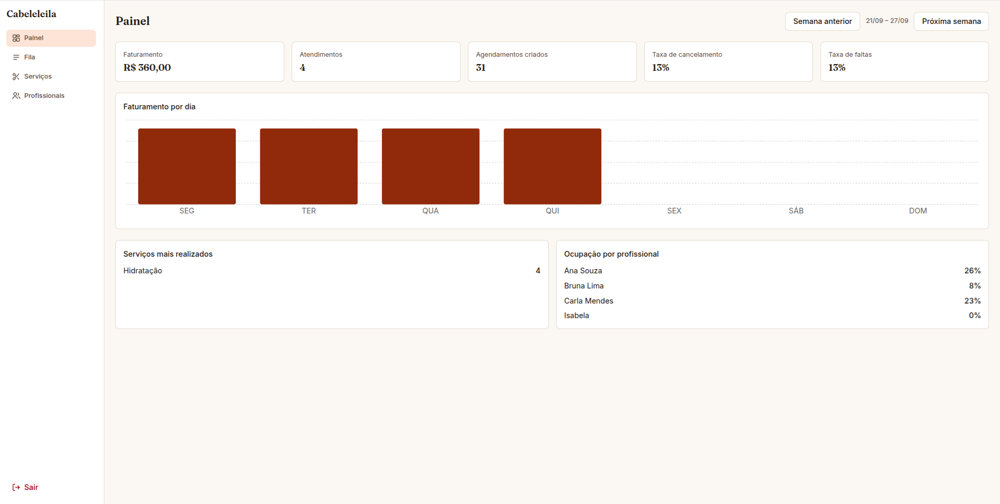 | 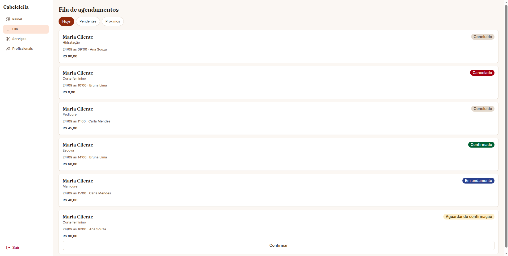 |

| Serviços | Profissionais |
| :---: | :---: |
| 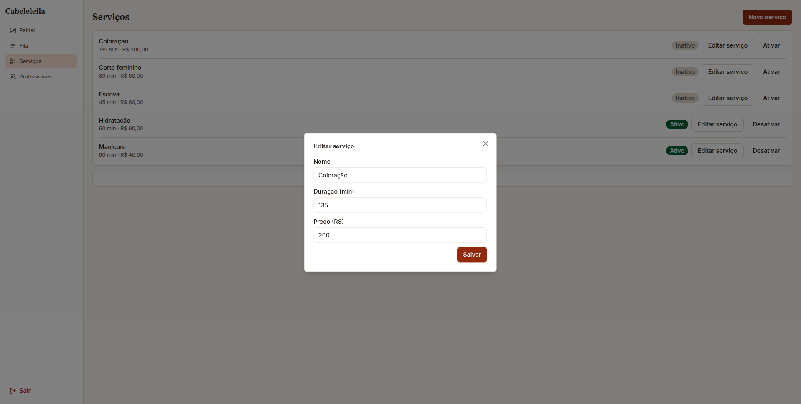 | 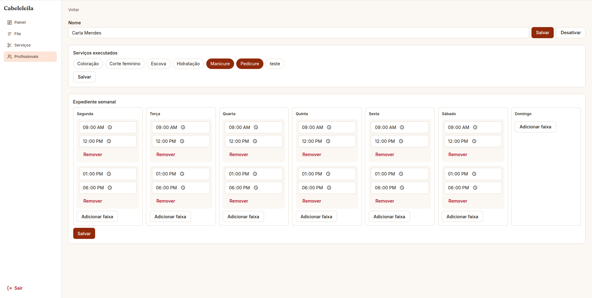 |

### Cliente (Mobile-first)

| Agendamentos | Detalhes do agendamento | Detalhes do agendamento |
| :---: | :---: | :---: |
|  | 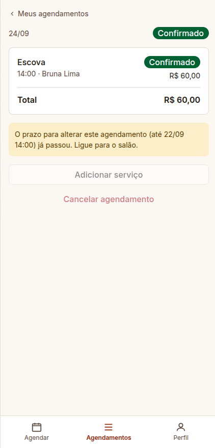 |  |

| Criando agendamento (1/2) | Criando agendamento (2/2) |
| :---: | :---: |
| 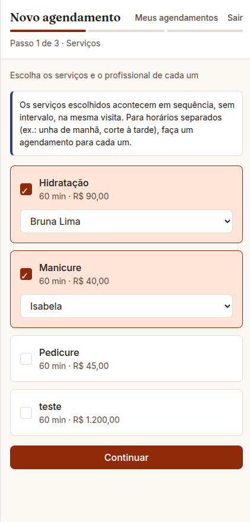 | 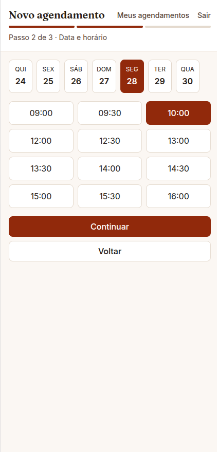 |

### Vídeo

Vídeo pode ser consultado via youtube pelo link não listado: https://youtu.be/sw2KDjpJdj4

## Tecnologias

### Backend
- **NestJS 12** (adaptador Fastify), TypeScript, ESM
- **Banco:** PostgreSQL 17 com TypeORM (migrations geradas a partir das entidades); `btree_gist` para a exclusion constraint de sobreposição de horário
- **Cache:** Redis via `@nestjs/cache-manager` + `@keyv/redis`, no endpoint do painel gerencial
- **Sessão e segurança:** `@nestjs/jwt`, argon2id (`@node-rs/argon2`), `@fastify/cookie`, `@fastify/csrf-protection`, `@nestjs/throttler`
- **Validação e documentação:** `class-validator`, `class-transformer`, `@nestjs/swagger`
- **Testes:** Vitest, `@faker-js/faker`, Postgres real nos testes de integração
- **Infra local:** Docker Compose (Postgres, Redis, Mailpit)
- **Ferramentas:** pnpm 12 (workspaces), oxlint, prettier

### Frontend
- **React 19** + **Vite**, TypeScript
- **Roteamento e dados:** TanStack Router (rotas por arquivo, guardas de papel em `beforeLoad`) e TanStack Query (cache/estado do servidor)
- **Estilo:** Tailwind CSS 4 + componentes shadcn/ui (Radix UI por baixo), Fraunces (títulos) e Inter (corpo/UI) via `@fontsource-variable`
- **Formulários:** React Hook Form + Zod
- **Gráficos:** Recharts (painel semanal)
- **Cliente HTTP tipado:** `openapi-fetch`, com tipos gerados do Swagger via `openapi-typescript` (`pnpm --filter web generate:api-types`) — o `schema.d.ts` gerado entra no repositório
- **Testes:** Vitest + Testing Library

## Como rodar

**Requisitos:** Node 24 ou superior, pnpm 12, Docker com Compose.

```bash
cp .env.example .env
pnpm install
pnpm infra:up                        # sobe postgres, redis e mailpit
pnpm --filter api build
pnpm --filter api migration:run
pnpm --filter api seed
pnpm dev:api                         # API em http://localhost:3000
pnpm dev:web                         # frontend em http://localhost:5173 (outro terminal)
```

| O quê | Onde |
|---|---|
| Frontend (cliente e admin) | http://localhost:5173 |
| API | http://localhost:3000/api |
| Swagger (docs interativas) | http://localhost:3000/api/docs |
| Mailpit (caixa de e-mail de teste) | http://localhost:8026 |

**Contas criadas pelo seed** (valores do `.env.example`):

| Papel | E-mail | Senha |
|---|---|---|
| Administradora (Leila) | `leila@cabeleleila.local` | `Leila@12345` |
| Cliente de demonstração | `cliente@cabeleleila.local` | `Cliente@12345` |

O seed cria 6 serviços e 3 profissionais com serviços e expediente, além de agendamentos na **semana atual** cobrindo todos os status de item (pendente, confirmado, em andamento, concluído, cancelado, faltou) — o suficiente para o painel e a fila abrirem populados. É idempotente: rodar de novo não duplica nada, não sobrescreve o que a Leila editou e só completa o que estiver faltando (uma profissional sem serviços/expediente, ou um dia da semana sem agendamento).

**Usando o Swagger:** faça `POST /api/auth/login` e as demais rotas passam a funcionar, porque a sessão fica em cookie. O Swagger UI busca e envia o token CSRF sozinho.

### Docker

`docker-compose.yml` sobe a infraestrutura local:

| Serviço | Imagem | Porta no host | Uso |
|---|---|---|---|
| `postgres` | postgres:17-alpine | 5434 | Banco da aplicação e banco dos testes de integração |
| `redis` | redis:7-alpine | 6381 | Cache do painel gerencial (`@nestjs/cache-manager`) |
| `mailpit` | axllent/mailpit | 8026 (web) · 1026 (SMTP) | Caixa de e-mail de teste — ainda sem nada enviando para ela (ver "O que ficou para depois") |

As portas fogem do padrão para não colidir com serviços que você já tenha na máquina, e podem ser trocadas no `.env`. Os dados do Postgres ficam no volume `postgres-data`; Redis e Mailpit são efêmeros.

```bash
pnpm infra:up      # sobe postgres, redis e mailpit
pnpm infra:down    # derruba os containers (o volume do postgres é mantido)
```

### Scripts

Na raiz:

| Comando | O que faz |
|---|---|
| `pnpm dev:api` | API em modo watch |
| `pnpm dev:web` | Frontend em modo dev (Vite) |
| `pnpm infra:up` / `pnpm infra:down` | Sobe e derruba postgres, redis e mailpit |
| `pnpm test` | Testes unitários de todos os pacotes |
| `pnpm lint` | Lint de todos os pacotes |

Em `apps/api` (`pnpm --filter api <script>`):

| Comando | O que faz |
|---|---|
| `build` | Compila para `dist/` (necessário antes de migrations e seed) |
| `migration:run` / `migration:revert` | Aplica ou desfaz migrations |
| `migration:generate src/shared/database/migrations/<Nome>` | Gera a migration a partir das entidades |
| `seed` | Popula os dados de demonstração |
| `test` | Testes unitários |
| `test:integration` | Testes de integração (exigem o Postgres de pé) |
| `lint`, `format` | oxlint e prettier |

Em `apps/web` (`pnpm --filter web <script>`):

| Comando | O que faz |
|---|---|
| `dev` | Servidor de desenvolvimento (Vite), com proxy para a API |
| `build` | Typecheck + build de produção |
| `test` | Testes de componentes e unidades (Vitest) |
| `generate:api-types` | Gera `src/shared/api/schema.d.ts` a partir do Swagger da API rodando |
| `lint` | oxlint |

## API

Prefixo `/api`. Todas as rotas exigem sessão, exceto as marcadas como públicas.

### Auth, usuários e catálogo

| Método e rota | Acesso | Descrição |
|---|---|---|
| `GET /auth/csrf` | público | Gera o token CSRF (e o cookie que o acompanha) |
| `POST /auth/register` | público | Cadastra um cliente e abre a sessão |
| `POST /auth/login` | público | Abre a sessão |
| `POST /auth/refresh` | público (usa o cookie) | Troca o refresh token por um par novo |
| `POST /auth/logout` | público (usa o cookie) | Encerra a sessão e revoga o refresh token |
| `GET /auth/me` | autenticado | Usuário da sessão |
| `PATCH /users/me` | autenticado | Altera nome e telefone do próprio perfil |
| `GET /services` | autenticado | Lista serviços, paginada (`?includeInactive=true` só vale para admin) |
| `POST /services` | admin | Cadastra serviço |
| `PATCH /services/:id` | admin | Altera ou ativa/desativa serviço |
| `GET /professionals` | autenticado | Lista profissionais, paginada (`?serviceId=` filtra por serviço; `?includeInactive=true` só admin) |
| `GET /professionals/:id` | autenticado | Detalhe com serviços e expediente semanal (inativo só para admin) |
| `POST /professionals` | admin | Cadastra profissional |
| `PATCH /professionals/:id` | admin | Altera ou ativa/desativa profissional |
| `PUT /professionals/:id/services` | admin | Define os serviços que a profissional executa |
| `PUT /professionals/:id/working-hours` | admin | Define o expediente semanal (várias faixas por dia) |

### Agendamento

| Método e rota | Acesso | Descrição |
|---|---|---|
| `GET /config` | público | Parâmetros de negócio do agendamento (fuso, duração do slot, antecedência mínima, janela de alteração) |
| `GET /availability` | autenticado | Horários disponíveis para uma cadeia de itens numa data |
| `POST /appointments` | cliente | Cria um agendamento |
| `GET /appointments` | autenticado | Lista agendamentos (cliente: os seus; administrador: todos), com filtros de período, status, profissional, serviço e busca |
| `GET /appointments/:id` | autenticado | Detalhe do agendamento |
| `GET /appointments/:id/history` | admin | Linha do tempo (quem fez o quê) |
| `POST /appointments/:id/items` | dono na janela / admin | Adiciona um item |
| `PATCH /appointments/:id/items/:itemId` | dono na janela / admin | Reposiciona um item (mesmo dia) |
| `POST /appointments/:id/confirm` | admin | Confirma todos os itens aguardando confirmação |
| `POST /appointments/:id/cancel` | dono na janela / admin | Cancela o agendamento inteiro |
| `POST /appointments/:id/items/:itemId/{confirmed\|in-progress\|completed\|no-show}` | admin | Muda o status operacional de um item |
| `POST /appointments/:id/items/:itemId/cancel` | dono na janela / admin | Cancela um item |

### Relatórios

| Método e rota | Acesso | Descrição |
|---|---|---|
| `GET /reports/weekly?weekStart=` | admin | Painel gerencial da semana (`weekStart` é ajustado para a segunda-feira que a contém). Resposta cacheada 60 s no Redis |

### Convenções

- **Sessão:** cookies `HttpOnly`. `access_token` (JWT de 15 min) vale para toda a API. `refresh_token` (7 dias) só é enviado para `/api/auth`.
- **CSRF:** requisições que alteram dados (`POST`, `PUT`, `PATCH`, `DELETE`) precisam do cabeçalho `x-csrf-token`, obtido em `GET /api/auth/csrf`. Sem ele, a resposta é `403` com `code: CSRF_INVALID`.
- **Paginação:** as listagens aceitam `?page=` (começa em 1, padrão 1) e `?limit=` (padrão 20, máximo 100) e respondem `{ items, total, page, limit, totalPages }`. A ordem é estável (nome e depois id), então nenhum item se repete ou se perde entre páginas. Valores inválidos respondem `400` em português.
- **Limite de requisições:** login e cadastro aceitam 10 por minuto.
- **Erros de negócio** com status ambíguo (`401`, `403`, `409`, `422`) seguem `{ statusCode, code, message }`, e o `code` é o identificador estável para quem consome a API decidir a reação:

| Código | Status | Quando |
|---|---|---|
| `INVALID_CREDENTIALS` | 401 | E-mail ou senha incorretos |
| `INVALID_REFRESH_TOKEN` | 401 | Refresh token ausente, expirado ou reutilizado |
| `CSRF_INVALID` | 403 | Token CSRF ausente ou inválido |
| `EMAIL_ALREADY_IN_USE` | 409 | E-mail já cadastrado (sem diferenciar maiúsculas) |
| `SLOT_TAKEN` | 409 | Horário ocupado entre o cálculo de disponibilidade e a confirmação |
| `SERVICES_NOT_FOUND` | 422 | Serviços informados que não existem (a resposta lista quais) |
| `INVALID_WORKING_HOURS` | 422 | Faixas do expediente sobrepostas ou invertidas |
| `INVALID_STATUS_TRANSITION` | 422 | Transição de status do item não permitida (ex.: confirmar item já cancelado) |
| `CHANGE_WINDOW_EXPIRED` | 422 | Cliente tentando alterar um item fora da janela de 48 h |

Lista não exaustiva — o agendamento tem mais alguns códigos de regra de negócio (`OUTSIDE_WORKING_HOURS`, `LEAD_TIME_TOO_SHORT`, `PROFESSIONAL_DOES_NOT_OFFER_SERVICE`, `ITEMS_OVERLAP`, `DATE_OUT_OF_RANGE`, `INVALID_GRID_START`); a lista completa está no Swagger.

- **Recurso inexistente** (ou inativo, para cliente) responde `404` no formato padrão do Nest, `{ statusCode, message, error }`, com a mensagem em português. Não há `code`, porque o contexto da chamada já diz o que não foi encontrado.
- **Erros de validação** vêm com status `400` e mensagens em português.
- **Idioma:** identificadores, colunas e enums em inglês; mensagens e interface em português.

## Modelo de dados

Convenções: chave primária **ULID** (`char(26)`, gerada pela própria entidade e ordenável por tempo), datas em `timestamptz` (UTC, preenchidas pelo banco), dinheiro em **centavos inteiros**, enum nativo, sem exclusão física (serviço e profissional têm `active`), terceira forma normal.

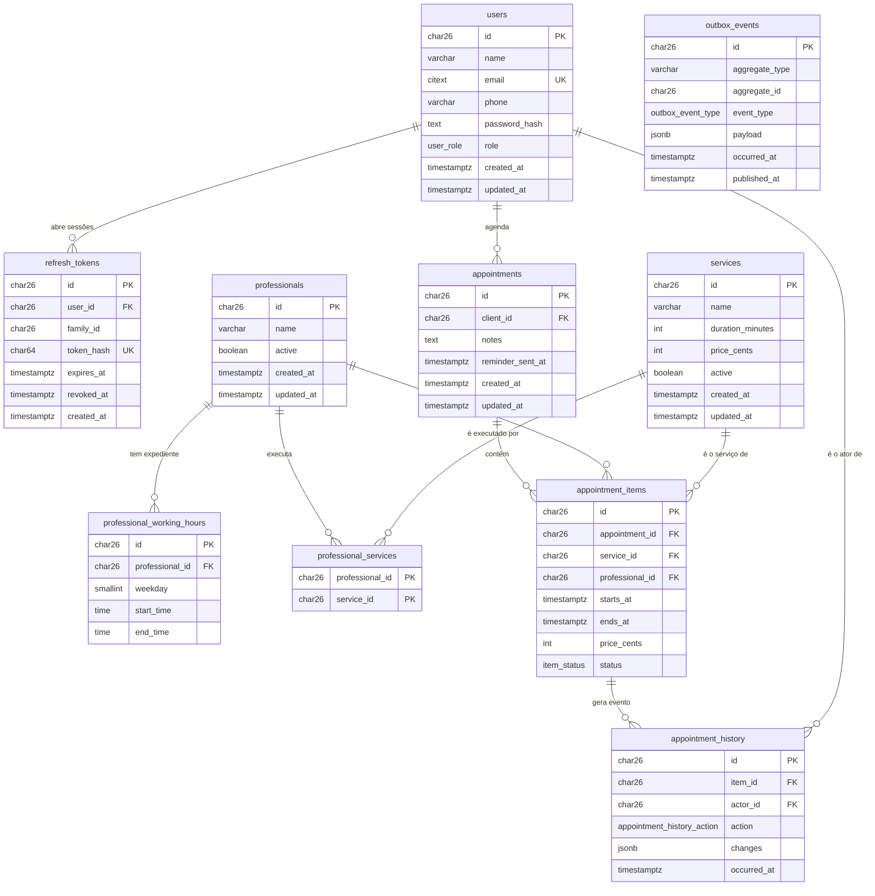

| Tabela | Detalhes |
|---|---|
| `users` | `email` é `citext` único (a comparação ignora maiúsculas); `role` é o enum `user_role` (`CLIENT` ou `ADMIN`); guarda só o hash argon2id da senha |
| `refresh_tokens` | Guarda o hash SHA-256 do token (nunca o token). `family_id` agrupa a cadeia de rotações de um login. Revogar é preencher `revoked_at`, sem apagar a linha |
| `services` | `CHECK` de duração positiva e múltipla de 15 min, e de preço maior ou igual a zero |
| `professionals` | Sem login próprio |
| `professional_services` | Tabela de ligação (muitos para muitos), chave primária composta |
| `professional_working_hours` | `weekday` de 1 (segunda) a 7 (domingo), `CHECK` de intervalo válido e de dia entre 1 e 7. Várias faixas no mesmo dia permitem pausa de almoço; a sobreposição entre faixas é validada no domínio |
| `appointments` | Uma ordem = uma visita = uma data. `reminder_sent_at` é zerado sempre que um item é reposicionado |
| `appointment_items` | `status` é o enum `item_status` (`PENDING`, `CONFIRMED`, `IN_PROGRESS`, `COMPLETED`, `CANCELLED`, `NO_SHOW`). `CHECK ck_item_interval` garante `ends_at > starts_at`. **`EXCLUDE ex_professional_no_overlap`** (via `btree_gist`) impede que a mesma profissional tenha dois itens não cancelados com horário sobreposto — é a garantia real contra corrida, junto com a checagem no código |
| `appointment_history` | Um evento por mudança de item (adicionado, reposicionado, status alterado), com quem fez e quando — alimenta a linha do tempo do admin |
| `outbox_events` | Fila de eventos notificáveis, gravada na mesma transação do estado (ver "O que ficou para depois"). `published_at` nulo = ainda não processado |
| `appointment_summaries` (view) | Não é tabela: `VIEW` só de leitura que agrega os itens de cada agendamento em `status`, `total_cents`, `starts_at`/`ends_at` — ver "View de leitura" nas decisões abaixo |

## Arquitetura

Monólito modular, com cada módulo de negócio (`users`, `auth`, `services`, `professionals`, `scheduling`, `reports`) organizado em quatro camadas **inspiradas em Clean Architecture**, mas não Clean Architecture no sentido estrito — ver a ressalva logo abaixo:

```
domain/            entidade (modelo + decorators do TypeORM), porta do repositório, exceções, regras puras
application/       use cases (uma classe por ação) e portas para o que o módulo precisa de outro módulo
infrastructure/    repositório TypeORM, adaptadores das portas
presentation/http/ controller e DTOs (entrada, resposta, filtros de listagem)
```

O fluxo é `controller → use case → repositório`. Nada de barramento de comandos: cada use case já é o handler. Módulos não acessam a tabela um do outro diretamente — quando `scheduling` precisa de algo de `professionals` (ex.: expediente), a dependência é uma porta própria (`domain/ports/...`) implementada por um adaptador em `scheduling/infrastructure/adapters/`, que por baixo usa o repositório do módulo dono do dado: quem consome depende de uma porta, nunca da infraestrutura concreta de outro módulo. Código compartilhado fica em `shared/` (configuração, banco, segurança HTTP, validação, decorators de autorização, utilitários de tempo/fuso horário).

**Por que não é Clean Architecture de verdade:** a regra de dependência da Clean Architecture exige que `domain` e `application` não conheçam nada de fora (nenhum framework). Aqui as entidades de `domain/` têm os decorators do **TypeORM** direto nelas (`@Entity`, `@Column`, `@ManyToOne`...), e todo use case em `application/` carrega `@Injectable()` do **NestJS**. Ou seja, as duas camadas mais internas dependem de framework — o oposto do que a regra pede. Foi uma escolha pragmática (evita uma camada extra só para converter entidade de domínio em entidade do ORM), não um Clean Architecture completo; o nome mais correto é arquitetura em camadas com portas e adaptadores entre módulos, emprestando a separação de responsabilidades da Clean Architecture sem a independência total de framework.

Estrutura da API:

```
apps/api/src/
├─ users/  auth/  services/  professionals/  scheduling/  reports/    módulos de negócio
├─ shared/                                                            config, database, http, auth, validation, security, time
└─ testing/                                                           factories e apoio aos testes de integração
```

Estrutura do frontend, organizada **por feature** (não por tipo de arquivo): cada domínio tem sua própria pasta com API e telas juntas, em vez de um `components/` e um `api/` únicos e genéricos para o projeto inteiro.

```
apps/web/src/
├─ app/                        setup do TanStack Query, estilos globais
├─ routes/                     rotas por arquivo (TanStack Router) — layouts _authenticated, _client, admin
├─ features/                   um diretório por domínio (auth, booking, appointments, queue, catalog, reports),
│                              cada um com api/ (query options e chamadas) e components/ (telas)
└─ shared/                     ui/ (componentes reutilizáveis), labels/ (textos em português), lib/, utils/, api/ (cliente HTTP)
```

## Frontend

- **Área do cliente** (`/book`, `/appointments`, `/profile`): **mobile-first**, navegação por abas inferior, mas funciona também em tela larga (o layout não quebra, só não foi desenhado prioritariamente para desktop).
- **Área administrativa** (`/admin`, `/admin/queue`, `/admin/services`, `/admin/professionals`): pensada para desktop, barra lateral fixa com ícones, nome do salão e logout.
- **Acessibilidade e contraste:** paleta com alvo **WCAG AAA** desde a escolha das cores — texto normal ≥ 7:1, texto grande ≥ 4.5:1, elemento gráfico não textual ≥ 3:1, cada valor calculado e registrado em `docs/design.pdf` (seção 10.4), não só escolhido visualmente. Por isso `accent-500` (a cor viva de ícone/gráfico) nunca carrega texto, e o aviso (âmbar) é sempre fundo claro + texto escuro, porque amarelo saturado quase nunca atinge 7:1 com texto branco.
- **Tipografia:** Fraunces nos títulos (caráter editorial), Inter no corpo/formulário/UI (alto x-height, mais legível em densidade — tabelas do admin, formulário do assistente).
- **Estado e HTTP:** TanStack Query para tudo que vem do servidor, com invalidação de cache por prefixo de chave após cada mutação (ex.: `['catalog', 'services']` invalida a lista e a versão paginada do admin juntas). Cliente HTTP único (`openapi-fetch`) com `credentials: 'include'` e injeção automática do `x-csrf-token`.
- **Paginação nas telas de admin:** serviços e profissionais usam rolagem por página (`useInfiniteQuery`, 5 por página) com botão "Carregar mais" — página pequena de propósito, para o comportamento ficar visível mesmo com poucos registros de demonstração.

## Decisões e insights

### Autenticação e segurança
- **Cookies `HttpOnly` em vez de token no `localStorage`:** o JavaScript da página não consegue ler a sessão, o que reduz o estrago de um XSS. O preço é precisar de proteção CSRF, resolvida com `SameSite` mais `@fastify/csrf-protection`. No Swagger e no frontend o token CSRF é anexado automaticamente.
- **Refresh token opaco com rotação:** cada renovação emite um token novo e revoga o anterior. Se um token já revogado reaparecer (sinal de roubo), toda a família daquele login é revogada, sem afetar as outras sessões do usuário. A revogação usa um `UPDATE ... WHERE revoked_at IS NULL` atômico, então duas renovações simultâneas com o mesmo token não passam as duas.
- **argon2id** (recomendação da OWASP) via `@node-rs/argon2`, porque o pnpm 12 bloqueia scripts de instalação e a versão nativa comum depende deles.
- **Login sem enumeração de usuários:** e-mail inexistente e senha errada respondem igual, e, quando o e-mail não existe, o sistema compara contra um hash falso para que o tempo de resposta não denuncie.
- **Proteção por padrão:** os guards globais exigem sessão em qualquer rota, e `@Public()` é a exceção declarada. `@Roles([Role.ADMIN])` restringe por papel, sempre no método do controller (nunca na classe), para cada rota declarar o próprio acesso sem ambiguidade quando um controller mistura rotas de cliente e de admin.
- **Helmet ficou de fora:** a API só devolve JSON, então a maior parte dos cabeçalhos que ele acrescenta não traz ganho aqui.

### Dados e domínio
- **ULID gerado na própria entidade** (`id: string = generateId()`): o TypeORM só gera `uuid` e `increment` sozinho. O ULID é ordenável por tempo e dispensa injetar um gerador de id em cada use case.
- **Datas pelo banco:** `@CreateDateColumn` e `@UpdateDateColumn` preenchem `created_at` e `updated_at`, então nenhum use case precisa de relógio só para isso.
- **Regras no banco quando possível:** `CHECK` de duração e preço, unicidade de e-mail com `citext`, faixas de expediente válidas e, principalmente, a **exclusion constraint** (`EXCLUDE ... USING gist`) que impede sobreposição de horário para a mesma profissional — é a garantia real contra corrida (duas requisições simultâneas para o mesmo horário): a checagem no código dá o erro amigável, a constraint garante a correção mesmo se o código falhar.
- **Migrations geradas, não escritas à mão:** o `migration:generate` compara as entidades com o banco. As extensões (`citext`, `btree_gist`) e a view de leitura são manuais, porque o gerador não cria isso.
- **Sem exclusão física:** serviço e profissional são desativados, para não quebrar histórico. Cliente só enxerga registros ativos; a regra `canSeeInactive` fica num único lugar.
- **`professional_services` como entidade própria** (`ProfessionalService`, com `@ManyToOne` para cada lado), no lugar de `@ManyToMany`/`@JoinTable`: como é uma tabela de ligação pura (sem colunas próprias), o TypeORM não a registra como entidade quando gerada só pela relação, o que obrigava a escrever SQL cru com nome de tabela e coluna para inserir e apagar direto nela. Com a entidade, `manager.delete()`/`manager.insert()` funcionam normalmente, como já acontece com o expediente (`WorkingHours`).

### View de leitura (`appointment_summaries`)
O status, o total e o horário "efetivo" de um agendamento são derivados dos itens (uma ordem some se todo item for cancelado; o horário de exibição ignora item cancelado, mas cai de volta para ele se não sobrar nenhum ativo). No começo essa lógica estava em SQL repetido dentro de cada consulta do repositório (inclusive um `ORDER BY` sobre uma subquery, que foi o bug original que motivou essa mudança — ordenar a lista de agendamentos por `startsAt` quebrava, porque `startsAt` não existe como coluna própria). Em vez de manter regra de negócio duplicada em cada `SELECT`, ela virou uma **view** (`CREATE VIEW appointment_summaries AS SELECT ... CASE ... GROUP BY appointment_id`), mapeada como entidade `@ViewEntity({ synchronize: false })` — o TypeORM lê e faz `JOIN`/`ORDER BY` nela como numa tabela normal, mas a única fonte da regra de agregação é a definição em SQL na migration, não código de aplicação espalhado. `synchronize: false` porque a migration é a única fonte de verdade da view; o TypeORM nunca tenta recriá-la sozinho.

### Cache do painel (Redis)
O `GET /reports/weekly` faz várias agregações sobre a tabela de itens (semana atual e anterior, ranking de serviços, ocupação por profissional), então a resposta é cacheada por chave de URL (inclui `weekStart`) com TTL de 60 s via `@nestjs/cache-manager` + `@keyv/redis`. Ficou **simples de propósito, por falta de tempo**: é só TTL, sem invalidação quando um agendamento muda de status — depois de confirmar/concluir um item, o painel pode levar até 60 s para refletir. Se houvesse mais tempo, a solução melhor seria **cache com versionamento**: guardar um número de versão (ex.: no Redis mesmo, incrementado a cada mutação relevante do módulo `scheduling`) e compor a chave do cache com ele (`reports:weekly:{weekStart}:v{versão}`) — assim a leitura fica imediatamente correta após qualquer mutação, sem precisar invalidar chave por chave nem esperar o TTL, e sem acoplar `reports` a saber exatamente quais eventos de `scheduling` importam. Outra opção considerada e descartada por ora: publicar um evento (via outbox, já existente) e invalidar a chave certa no consumidor — mais preciso, mas depende do worker que ainda não existe (ver "O que ficou para depois").

### API
- **Serialização estrita:** o interceptor global usa a estratégia `excludeAll`, então só sai o que tem `@Expose()`. O controller devolve a entidade (ou o agregado do use case) e `@Serialize(Classe)` declara o formato da resposta e o Swagger no mesmo lugar. Um handler que esquecer de declarar responde `{}` em vez de vazar o hash da senha.
- **Erros com as exceções nativas do Nest**, cada uma com um `code` estável para quem consome a API. Uma camada própria de erros foi implementada e depois removida por ser código a mais sem ganho.
- **Validação em português** no `ValidationPipe` global (`whitelist` e `forbidNonWhitelisted`); o telefone é validado com `@IsPhoneNumber('BR')` e guardado em formato internacional (E.164).
- **Normalização na entrada:** um `@Transform` nos DTOs remove os espaços do nome antes da validação, então `" A "` é rejeitado pelo mínimo de 2 caracteres. Os use cases recebem dado já limpo.
- **Edição sem carregar a entidade:** o body validado vai direto para o `UPDATE` (cada use case declara sua interface de entrada, e o repositório aceita um `Partial<Pick<Entidade, ...>>`) (o TypeORM ignora campos `undefined`, e `null` limpa a coluna). O repositório devolve a entidade atualizada, ou `null` se ela não existir, e o use case transforma isso em 404.
- **Paginação por página e limite** (`page`/`limit`), com o total na resposta: atende a telas com "página 2 de 5" e é o modelo mais simples para catálogos e históricos. O DTO `PaginationQuery` é compartilhado (as listagens estendem a classe), e a resposta é montada por uma fábrica de classes (`PageResponse`) para o Swagger documentar os itens de cada página. Paginação por cursor foi descartada: só compensa com listas enormes ou muito alteradas.
- **Query string booleana:** `?includeInactive=false` chega como texto, e a conversão implícita do `class-transformer` transformaria `"false"` em `true`. Um transformador próprio converte só `"true"` e `"false"` e deixa o resto falhar na validação.
- **Concorrência na criação:** checagem no código (expediente, duração, sequência, regra das 48 h, sobreposição) dá o erro amigável; a exclusion constraint garante a correção mesmo em corrida (`23P01` do Postgres vira `409 SLOT_TAKEN`). Sem lock, porque não há linha existente para travar numa criação nova.
- **Concorrência na alteração** (mudar status, cancelar, reposicionar, adicionar item): `pessimistic_write` na linha do agendamento, transação curta, com a máquina de estados validada sobre o dado fresco dentro da transação.

### Testes
- **Backend unitário com mocks escritos no próprio teste**, só do que ele usa (`vi.fn<Porta['metodo']>()`). Sem repositórios "em memória" que reimplementariam o SQL.
- **Backend de integração com Postgres real:** repositórios (relations, unicidade, `CHECK`s, exclusion constraint, atomicidade) e fluxos HTTP completos (`createTestApp`, `TestClient` com jar de cookies + CSRF, `loginAs`) rodam contra um banco `<POSTGRES_DB>_test`, criado e migrado automaticamente e limpo a cada teste.
- **Factories com faker**, uma por entidade, com `makeX` (em memória) e `createX` (persiste).
- **Frontend com Vitest + Testing Library:** componentes renderizados com o roteador real (`createMemoryHistory`) quando usam `<Link>`/navegação, mutações testadas verificando o efeito observável (a chamada HTTP esperada, o texto que aparece depois), sem testar detalhe de implementação.

## Testes

```bash
pnpm --filter api test               # unitários — 340 testes
pnpm --filter api test:integration   # integração, exige o Postgres de pé — 140 testes
pnpm --filter web test               # frontend — 195 testes
```

Os testes de integração do backend criam o banco `<POSTGRES_DB>_test` no mesmo container e nunca tocam o banco da aplicação.
