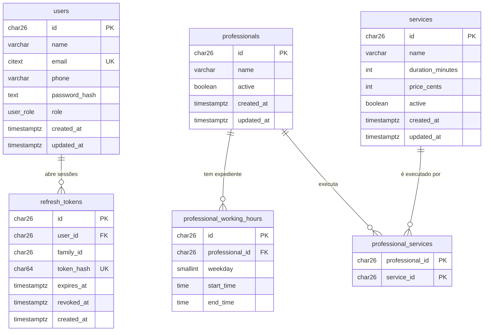

# Cabeleleila Leila — Agendamento online

API do sistema de agendamento online do salão da Leila (caso técnico DSIN).

## O que existe hoje

- **Cadastro e login** com sessão em cookies `HttpOnly`, refresh token com rotação e proteção CSRF
- **Papéis** de cliente e administradora, com rotas protegidas por padrão
- **Perfil** do usuário (nome e telefone)
- **Catálogo:** serviços, profissionais, serviços que cada profissional executa e expediente semanal, com listagens paginadas
- **Documentação interativa** (Swagger) e **dados de demonstração** (seed)
- **Testes** unitários e de integração com Postgres real

## Tecnologias

- **Backend:** NestJS 12 (adaptador Fastify), TypeScript, ESM
- **Banco:** PostgreSQL 17 com TypeORM 1.x (migrations geradas a partir das entidades)
- **Sessão e segurança:** `@nestjs/jwt`, argon2id (`@node-rs/argon2`), `@fastify/cookie`, `@fastify/csrf-protection`, `@nestjs/throttler`
- **Validação e documentação:** `class-validator`, `class-transformer`, `@nestjs/swagger`
- **Testes:** Vitest, `@faker-js/faker`, Postgres real nos testes de integração
- **Infra local:** Docker Compose (Postgres)
- **Ferramentas:** pnpm 12 (workspaces), oxlint, prettier

## Como rodar

**Requisitos:** Node 24 ou superior, pnpm 12, Docker com Compose.

```bash
cp .env.example .env
pnpm install
pnpm infra:up
pnpm --filter api build
pnpm --filter api migration:run
pnpm --filter api seed
pnpm dev:api
```

| O quê | Onde |
|---|---|
| API | http://localhost:3000/api |
| Swagger (docs interativas) | http://localhost:3000/api/docs |

**Contas criadas pelo seed** (valores do `.env.example`):

| Papel | E-mail | Senha |
|---|---|---|
| Administradora (Leila) | `leila@cabeleleila.local` | `Leila@12345` |
| Cliente de demonstração | `cliente@cabeleleila.local` | `Cliente@12345` |

O seed também cria 6 serviços e 3 profissionais com serviços e expediente. Ele é idempotente: rodar de novo não duplica nada, não sobrescreve o que a Leila editou e só completa o que estiver faltando (por exemplo, uma profissional sem serviços ou sem expediente).

**Usando o Swagger:** faça `POST /api/auth/login` e as demais rotas passam a funcionar, porque a sessão fica em cookie. O Swagger UI busca e envia o token CSRF sozinho.

### Docker

`docker-compose.yml` sobe o banco de desenvolvimento:

| Serviço | Imagem | Porta no host | Uso |
|---|---|---|---|
| `postgres` | postgres:17-alpine | 5434 | Banco da aplicação e banco dos testes de integração |

A porta foge do padrão (5432) para não colidir com um Postgres que você já tenha na máquina, e pode ser trocada no `.env`. Os dados ficam no volume `postgres-data`.

```bash
pnpm infra:up      # sobe o postgres
pnpm infra:down    # derruba o container (o volume é mantido)
```

### Scripts

Na raiz:

| Comando | O que faz |
|---|---|
| `pnpm dev:api` | API em modo watch |
| `pnpm infra:up` / `pnpm infra:down` | Sobe e derruba o banco |
| `pnpm test` | Testes unitários de todos os pacotes |
| `pnpm lint` | Lint de todos os pacotes |

Em `apps/api` (`pnpm --filter api <script>`):

| Comando | O que faz |
|---|---|
| `build` | Compila para `dist/` (necessário antes de migrations e seed) |
| `migration:run` / `migration:revert` | Aplica ou desfaz migrations |
| `migration:generate src/shared/database/migrations/<Nome>` | Gera a migration a partir das entidades |
| `seed` | Popula os dados de demonstração |
| `test` | Testes unitários |
| `test:integration` | Testes de integração (exigem o Postgres de pé) |
| `lint`, `format` | oxlint e prettier |

## API

Prefixo `/api`. Todas as rotas exigem sessão, exceto as marcadas como públicas.

| Método e rota | Acesso | Descrição |
|---|---|---|
| `GET /auth/csrf` | público | Gera o token CSRF (e o cookie que o acompanha) |
| `POST /auth/register` | público | Cadastra um cliente e abre a sessão |
| `POST /auth/login` | público | Abre a sessão |
| `POST /auth/refresh` | público (usa o cookie) | Troca o refresh token por um par novo |
| `POST /auth/logout` | público (usa o cookie) | Encerra a sessão e revoga o refresh token |
| `GET /auth/me` | autenticado | Usuário da sessão |
| `PATCH /users/me` | autenticado | Altera nome e telefone do próprio perfil |
| `GET /services` | autenticado | Lista serviços, paginada (`?includeInactive=true` só vale para admin) |
| `POST /services` | admin | Cadastra serviço |
| `PATCH /services/:id` | admin | Altera ou ativa/desativa serviço |
| `GET /professionals` | autenticado | Lista profissionais, paginada (`?serviceId=` filtra por serviço; `?includeInactive=true` só admin) |
| `GET /professionals/:id` | autenticado | Detalhe com serviços e expediente semanal (inativo só para admin) |
| `POST /professionals` | admin | Cadastra profissional |
| `PATCH /professionals/:id` | admin | Altera ou ativa/desativa profissional |
| `PUT /professionals/:id/services` | admin | Define os serviços que a profissional executa |
| `PUT /professionals/:id/working-hours` | admin | Define o expediente semanal (várias faixas por dia) |

### Convenções

- **Sessão:** cookies `HttpOnly`. `access_token` (JWT de 15 min) vale para toda a API. `refresh_token` (7 dias) só é enviado para `/api/auth`.
- **CSRF:** requisições que alteram dados (`POST`, `PUT`, `PATCH`, `DELETE`) precisam do cabeçalho `x-csrf-token`, obtido em `GET /api/auth/csrf`. Sem ele, a resposta é `403` com `code: CSRF_INVALID`.
- **Paginação:** as listagens aceitam `?page=` (começa em 1, padrão 1) e `?limit=` (padrão 20, máximo 100) e respondem `{ items, total, page, limit, totalPages }`. A ordem é estável (nome e depois id), então nenhum item se repete ou se perde entre páginas. Valores inválidos respondem `400` em português.
- **Limite de requisições:** login e cadastro aceitam 10 por minuto.
- **Erros de negócio** com status ambíguo (`401`, `403`, `409`, `422`) seguem `{ statusCode, code, message }`, e o `code` é o identificador estável para quem consome a API decidir a reação:

| Código | Status | Quando |
|---|---|---|
| `INVALID_CREDENTIALS` | 401 | E-mail ou senha incorretos |
| `INVALID_REFRESH_TOKEN` | 401 | Refresh token ausente, expirado ou reutilizado |
| `CSRF_INVALID` | 403 | Token CSRF ausente ou inválido |
| `EMAIL_ALREADY_IN_USE` | 409 | E-mail já cadastrado (sem diferenciar maiúsculas) |
| `SERVICES_NOT_FOUND` | 422 | Serviços informados que não existem (a resposta lista quais) |
| `INVALID_WORKING_HOURS` | 422 | Faixas do expediente sobrepostas ou invertidas |

- **Recurso inexistente** (ou inativo, para cliente) responde `404` no formato padrão do Nest, `{ statusCode, message, error }`, com a mensagem em português. Não há `code`, porque o contexto da chamada já diz o que não foi encontrado.
- **Erros de validação** vêm com status `400` e mensagens em português.
- **Idioma:** identificadores, colunas e enums em inglês; mensagens e interface em português.

## Modelo de dados

Convenções: chave primária **ULID** (`char(26)`, gerada pela própria entidade e ordenável por tempo), datas em `timestamptz` (UTC, preenchidas pelo banco), dinheiro em **centavos inteiros**, enum nativo, sem exclusão física (serviço e profissional têm `active`), terceira forma normal.



| Tabela | Detalhes |
|---|---|
| `users` | `email` é `citext` único (a comparação ignora maiúsculas); `role` é o enum `user_role` (`CLIENT` ou `ADMIN`); guarda só o hash argon2id da senha |
| `refresh_tokens` | Guarda o hash SHA-256 do token (nunca o token). `family_id` agrupa a cadeia de rotações de um login. Revogar é preencher `revoked_at`, sem apagar a linha |
| `services` | `CHECK` de duração positiva e múltipla de 15 min, e de preço maior ou igual a zero |
| `professionals` | Sem login próprio |
| `professional_services` | Tabela de ligação (muitos para muitos), chave primária composta |
| `professional_working_hours` | `weekday` de 1 (segunda) a 7 (domingo), `CHECK` de intervalo válido e de dia entre 1 e 7. Várias faixas no mesmo dia permitem pausa de almoço; a sobreposição entre faixas é validada no domínio |

## Arquitetura

Monólito modular. Cada módulo (`users`, `auth`, `services`, `professionals`) tem quatro camadas:

```
domain/            entidade (modelo + decorators do TypeORM), porta do repositório, exceções
application/       use cases: uma classe por ação
infrastructure/    repositório TypeORM
presentation/http/ controller e DTOs (entrada, resposta, filtros de listagem)
```

O fluxo é `controller → use case → repositório`. Nada de barramento de comandos: cada use case já é o handler. Código compartilhado fica em `shared/` (configuração, banco, segurança HTTP, validação, decorators de autorização).

Estrutura da API:

```
apps/api/src/
├─ users/  auth/  services/  professionals/    módulos de negócio
├─ shared/                                     config, database, http, auth, validation, security
└─ testing/                                    factories e apoio aos testes de integração
```

## Decisões e insights

### Autenticação e segurança
- **Cookies `HttpOnly` em vez de token no `localStorage`:** o JavaScript da página não consegue ler a sessão, o que reduz o estrago de um XSS. O preço é precisar de proteção CSRF, resolvida com `SameSite` mais `@fastify/csrf-protection`. No Swagger o token CSRF é anexado automaticamente.
- **Refresh token opaco com rotação:** cada renovação emite um token novo e revoga o anterior. Se um token já revogado reaparecer (sinal de roubo), toda a família daquele login é revogada, sem afetar as outras sessões do usuário. A revogação usa um `UPDATE ... WHERE revoked_at IS NULL` atômico, então duas renovações simultâneas com o mesmo token não passam as duas.
- **argon2id** (recomendação da OWASP) via `@node-rs/argon2`, porque o pnpm 12 bloqueia scripts de instalação e a versão nativa comum depende deles.
- **Login sem enumeração de usuários:** e-mail inexistente e senha errada respondem igual, e, quando o e-mail não existe, o sistema compara contra um hash falso para que o tempo de resposta não denuncie.
- **Proteção por padrão:** os guards globais exigem sessão em qualquer rota, e `@Public()` é a exceção declarada. `@Roles([Role.ADMIN])` restringe por papel. Sem Passport: há uma única estratégia, e o caminho da documentação do Nest é guard próprio com `@nestjs/jwt`.
- **Helmet ficou de fora:** a API só devolve JSON, então a maior parte dos cabeçalhos que ele acrescenta não traz ganho aqui.

### Dados e domínio
- **ULID gerado na própria entidade** (`id: string = generateId()`): o TypeORM só gera `uuid` e `increment` sozinho. O ULID é ordenável por tempo e dispensa injetar um gerador de id em cada use case.
- **Datas pelo banco:** `@CreateDateColumn` e `@UpdateDateColumn` preenchem `created_at` e `updated_at`, então nenhum use case precisa de relógio só para isso.
- **Regras no banco quando possível:** `CHECK` de duração e preço, unicidade de e-mail com `citext` e faixas de expediente válidas. Uma regra do banco vale até para quem escreve SQL direto.
- **Migrations geradas, não escritas à mão:** o `migration:generate` compara as entidades com o banco. Só a extensão `citext` é manual, porque o gerador não cria extensões.
- **Sem exclusão física:** serviço e profissional são desativados, para não quebrar histórico. Cliente só enxerga registros ativos; a regra `canSeeInactive` fica num único lugar.
- **Hash da senha na entidade** (`user.setPassword()` e `user.verifyPassword()`), sem uma abstração à parte.
- **`update()` em uma única ida ao banco:** `.whereEntity(entidade)` + `.returning('*')` + `.updateEntity(true)` fazem o `UPDATE` devolver a linha já mapeada para a entidade (sem o `SELECT` extra que o `repository.update()` simples exigiria). É preciso `.whereEntity()`, não `.where()`; testado diretamente contra o banco antes de aplicar.
- **`professional_services` como entidade própria** (`ProfessionalService`, com `@ManyToOne` para cada lado), no lugar de `@ManyToMany`/`@JoinTable`: como é uma tabela de ligação pura (sem colunas próprias), o TypeORM não a registra como entidade quando gerada só pela relação, o que obrigava a escrever SQL cru com nome de tabela e coluna para inserir e apagar direto nela. Com a entidade, `manager.delete()`/`manager.insert()` funcionam normalmente, como já acontece com o expediente (`WorkingHours`).

### API
- **Serialização estrita:** o interceptor global usa a estratégia `excludeAll`, então só sai o que tem `@Expose()`. O controller devolve a entidade e `@Serialize(Classe)` declara o formato da resposta e o Swagger no mesmo lugar. Um handler que esquecer de declarar responde `{}` em vez de vazar o hash da senha.
- **Erros com as exceções nativas do Nest**, cada uma com um `code` estável para quem consome a API. Uma camada própria de erros foi implementada e depois removida por ser código a mais sem ganho.
- **Validação em português** no `ValidationPipe` global (`whitelist` e `forbidNonWhitelisted`); o telefone é validado com `@IsPhoneNumber('BR')` e guardado em formato internacional (E.164).
- **Normalização na entrada:** um `@Transform` nos DTOs remove os espaços do nome antes da validação, então `" A "` é rejeitado pelo mínimo de 2 caracteres. Os use cases recebem dado já limpo.
- **Edição sem carregar a entidade:** o body validado vai direto para o `UPDATE` (cada use case declara sua interface de entrada, e o repositório aceita um `Partial<Pick<Entidade, ...>>`) (o TypeORM ignora campos `undefined`, e `null` limpa a coluna). O repositório devolve a entidade atualizada, ou `null` se ela não existir, e o use case transforma isso em 404.
- **Paginação por página e limite** (`page`/`limit`), com o total na resposta: atende a telas com "página 2 de 5" e é o modelo mais simples para catálogos e históricos. O DTO `PaginationQuery` é compartilhado (as listagens estendem a classe), e a resposta é montada por uma fábrica de classes (`PageResponse`) para o Swagger documentar os itens de cada página. Paginação por cursor foi descartada: só compensa com listas enormes ou muito alteradas.
- **Query string booleana:** `?includeInactive=false` chega como texto, e a conversão implícita do `class-transformer` transformaria `"false"` em `true`. Um transformador próprio converte só `"true"` e `"false"` e deixa o resto falhar na validação.

### Testes
- **Unitários com mocks escritos no próprio teste**, só do que ele usa (`vi.fn<Porta['metodo']>()`). Sem repositórios "em memória" que reimplementariam o SQL.
- **Integração com Postgres real:** os repositórios e os fluxos HTTP (registro, login, rotação e reuso de refresh token, permissões de admin e cliente) rodam contra um banco `<POSTGRES_DB>_test`, criado e migrado automaticamente e limpo a cada teste. Foi assim que constraints, relations e a atomicidade do refresh token passaram a ter cobertura de verdade.
- **Factories com faker**, uma por entidade, com `makeX` (em memória) e `createX` (persiste).

## Testes

```bash
pnpm --filter api test               # unitários
pnpm --filter api test:integration   # integração (exige o Postgres de pé)
```

Os testes de integração criam o banco `<POSTGRES_DB>_test` no mesmo container e nunca tocam o banco da aplicação.
